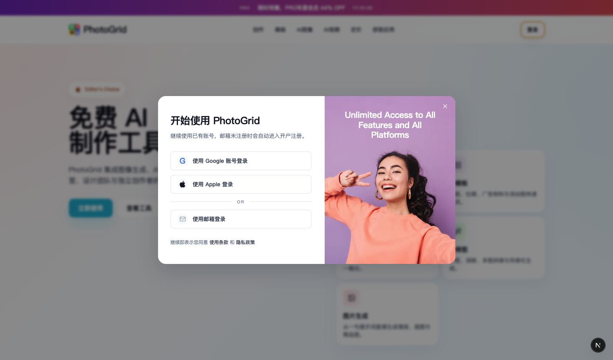
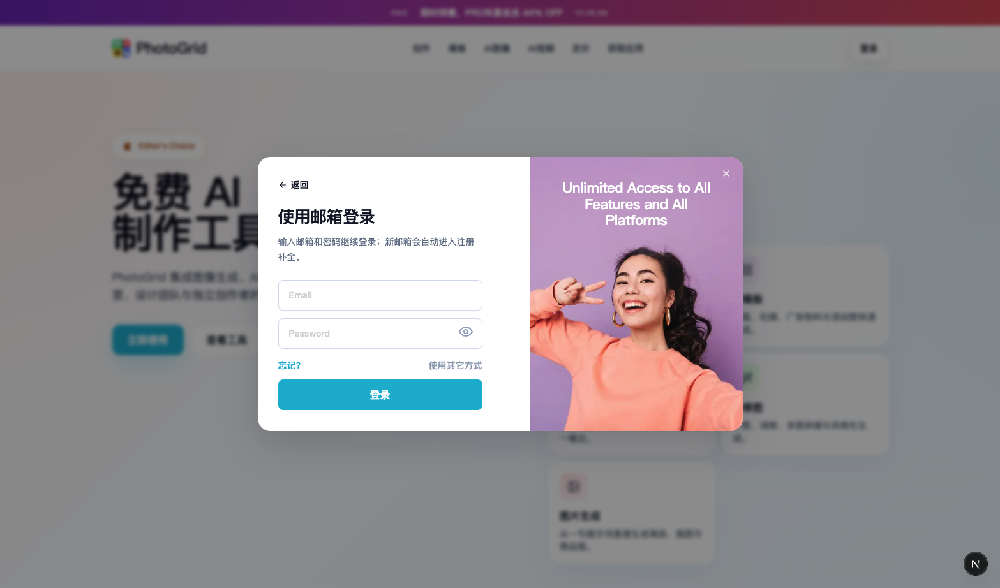

# 登录注册流程 PRD

## 1. 文档目标
- 明确当前站点登录注册弹窗的产品目标、交互路径和状态规则。
- 沉淀前端已实现的流程，便于后续接入真实认证接口。
- 通过截图说明各关键状态，减少对口头同步的依赖。

## 2. 适用范围
- 页面入口：站点首页右上角 `登录` 按钮。
- 展现形态：登录注册弹窗，不单独占用路由。
- 适用对象：未登录用户。

## 3. 设计原则
- 首屏先让用户选择登录方式，不直接压给邮箱表单。
- 第三方登录走标准 OAuth 验证流程入口。
- 邮箱登录优先复用“登录入口”，新用户邮箱在提交后自动转入注册补全。
- 登录与注册表单视觉保持简约、一致，不引入复杂模式切换。

## 4. 核心流程

### 4.1 入口
1. 用户点击导航栏 `登录`。
2. 页面打开认证弹窗。
3. 弹窗默认展示“登录方式选择”。

### 4.2 登录方式选择
- 提供三个入口：
  - `使用 Google 账号登录`
  - `使用 Apple 登录`
  - `使用邮箱登录`
- Google / Apple 当前为 OAuth 预留入口，后续应跳转到真实认证流程。
- `使用邮箱登录` 进入邮箱登录表单。

### 4.3 邮箱登录
- 用户填写邮箱和密码后点击 `登录`。
- 系统先判断邮箱是否为已注册用户：
  - 若是已注册邮箱：进入登录校验流程。
  - 若是新邮箱：不报错，自动进入注册补全页。

### 4.4 新邮箱自动注册补全
- 自动带入：
  - 用户刚输入的邮箱
  - 用户刚输入的第一次密码
- 用户只需补填：
  - `确认密码`
- 用户点击 `注册` / `完成注册` 后提交注册请求。

### 4.5 忘记密码
- 在邮箱登录页点击 `忘记?`
- 进入重设密码页
- 输入邮箱后点击 `发送重设链接`
- 后续由邮件服务完成找回密码链路

## 5. 页面与状态说明

### 5.1 登录方式选择页
- 目标：降低首屏认知压力，让用户先选认证方式。
- 内容结构：
  - 标题
  - Google / Apple 两个第三方入口
  - `or` 分隔线
  - 邮箱登录入口
  - 协议说明

截图：

### 5.2 邮箱登录页
- 目标：支持已注册用户快速登录。
- 字段：
  - `Email`
  - `Password`
- 辅助操作：
  - `忘记?`
  - `使用其它方式`
- 校验规则：
  - 邮箱不能为空
  - 邮箱格式必须合法
  - 密码不能为空

截图：

### 5.3 新邮箱自动转注册补全
- 触发条件：邮箱登录提交时，识别为未注册邮箱。
- 页面目标：不打断用户，直接把登录输入转成注册流程。
- 字段：
  - `Email`（自动带入）
  - `Password`（自动带入）
  - `Confirm Password`（用户补填）
- 校验规则：
  - 邮箱不能为空且格式合法
  - 密码长度需满足规则
  - 二次确认密码必须与第一次一致

截图：

### 5.4 忘记密码页
- 目标：用户可从邮箱登录页进入找回密码流程。
- 字段：
  - `Email`
- 校验规则：
  - 邮箱不能为空
  - 邮箱格式必须合法
- 结果：
  - 触发邮件发送逻辑
  - 给出提交成功反馈

截图：

## 6. 状态流转

### 6.1 主状态
- `methods`
- `email-login`
- `email-register`
- `reset-password`

### 6.2 状态转移
- `methods -> email-login`
  - 点击 `使用邮箱登录`
- `methods -> google oauth`
  - 点击 `使用 Google 账号登录`
- `methods -> apple oauth`
  - 点击 `使用 Apple 登录`
- `email-login -> email-register`
  - 提交邮箱登录且邮箱判定为新用户
- `email-login -> reset-password`
  - 点击 `忘记?`
- `email-login -> methods`
  - 点击 `返回` 或 `使用其它方式`
- `email-register -> email-login`
  - 点击 `返回`
- `reset-password -> email-login`
  - 点击 `返回`

## 7. 字段规则

### 7.1 邮箱
- 必填
- 格式校验：标准邮箱格式

### 7.2 登录密码
- 必填

### 7.3 注册密码
- 必填
- 当前前端规则：长度不少于 8 位
- UI 文案可按产品需要调整为 `6-20 个字符`，但前后端规则需一致

### 7.4 确认密码
- 必填
- 必须与注册密码一致

## 8. 视觉规范
- 登录方式选择、登录表单、注册表单应保持同一套尺寸密度。
- 输入框与主按钮不应明显大于登录方式按钮组。
- 登录与注册输入框采用简约样式：
  - 白底
  - 浅灰蓝边框
  - 轻阴影
  - 浅灰占位文字
  - 右侧眼睛图标
- 不额外引入重型分段控件、页签切换或双层登录页。

## 9. 当前实现说明
- 当前是前端流程原型，未接真实认证接口。
- Google / Apple 为验证流程占位入口。
- 邮箱是否已注册，当前使用 mock 数据判断。
- 登录成功、注册成功、重设密码成功，当前使用反馈提示模拟。

## 10. 后续接入建议
1. 接入 Google OAuth
2. 接入 Apple OAuth
3. 提供邮箱是否已注册的服务端查询接口，替代前端 mock
4. 接入邮箱登录接口
5. 接入邮箱注册接口
6. 接入发送重设密码邮件接口
7. 统一前后端密码规则与错误提示文案

## 11. 验收标准
1. 点击 `登录` 后，默认展示登录方式选择弹窗。
2. Google / Apple 入口具备清晰的验证流程跳转点。
3. 点击 `使用邮箱登录` 能进入邮箱登录表单。
4. 已注册邮箱提交后进入登录校验逻辑。
5. 新邮箱提交后自动进入注册补全页，并保留邮箱与第一次密码输入。
6. 注册补全页要求用户填写确认密码。
7. 点击 `忘记?` 可进入重设密码页。
8. 各状态页都支持 `返回` 回到上一步。
9. 登录与注册输入框、按钮尺寸风格与登录方式选择按钮保持一致。
